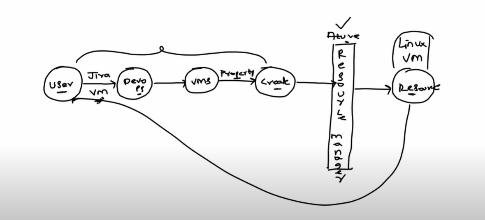
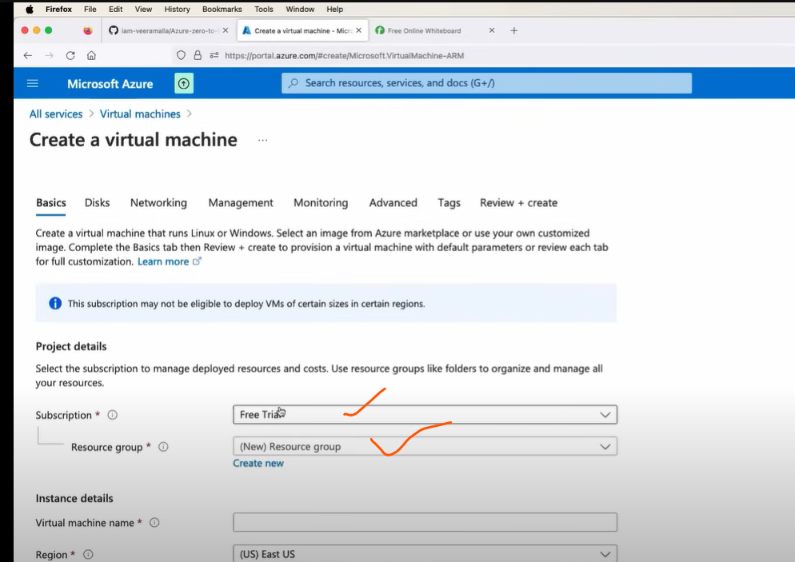
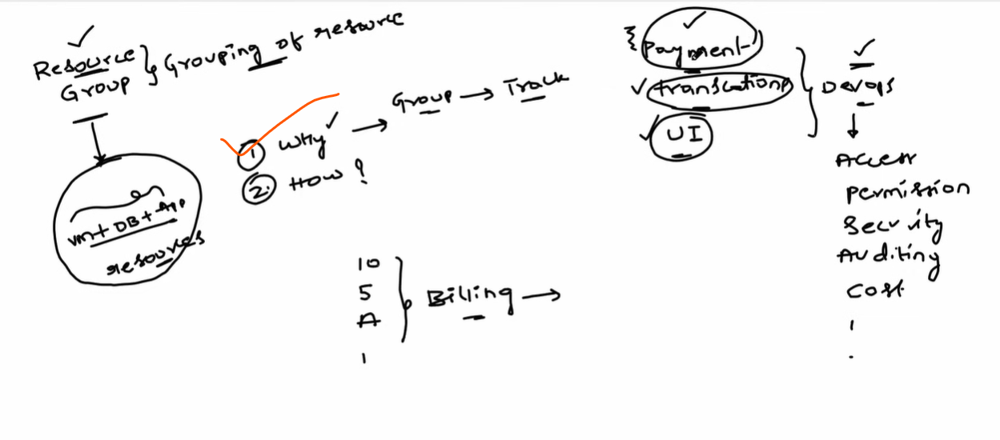
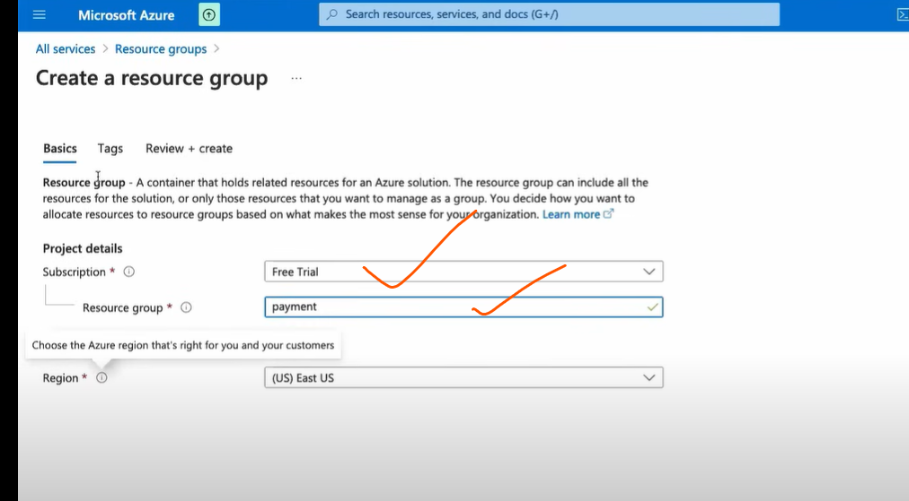
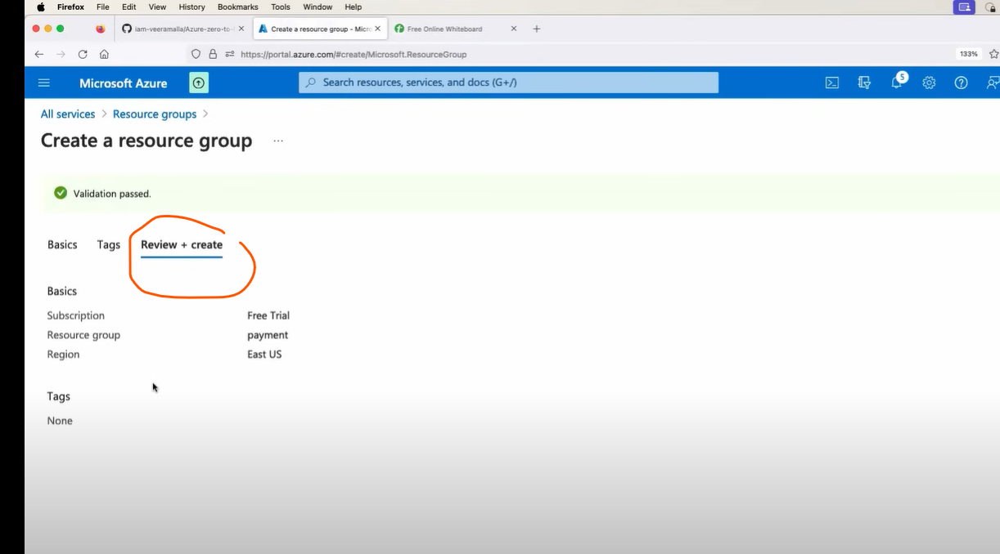
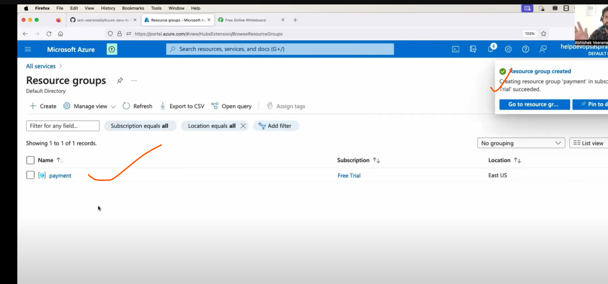
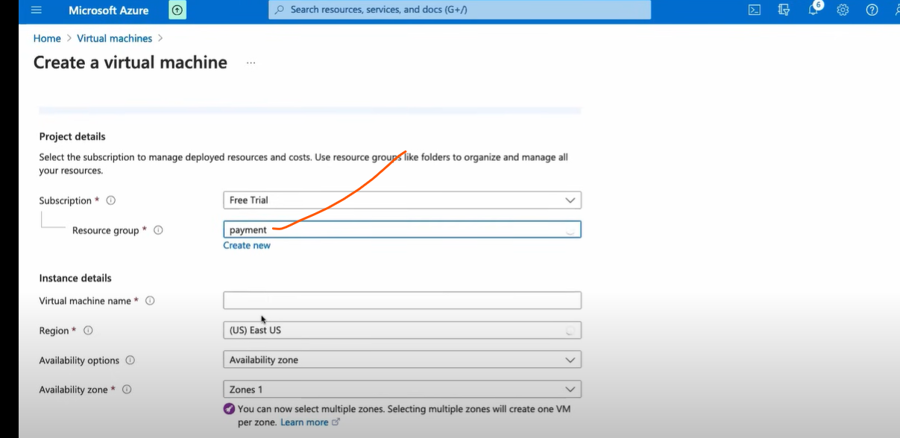

## aZure resource manager(ARM)
## resource group

* `resource group` is a mandatory feild in azure without this we cannot create resources in azure platform.

### creation of resource group
----------------------------------------------------------------------

* after creating a resource group we can do,

